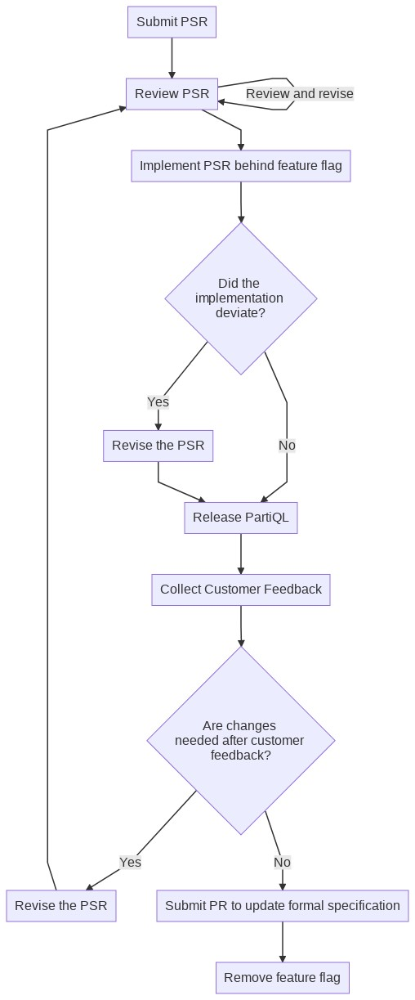

# A Proposal for Proposing Specification Changes 

## Definitons 

- `PartiQL Implementation`: an implementation of the partiql language such as the 
[reference implementation](https://github.com/partiql/partiql-lang-kotlin/).
- `PartiQL service`: a component that combines PartiQL with data sources

## Background

In an ideal world when a new feature is added to the PartiQL language the process for doing so 
would be:

- The PartiQL specification is updated *first*.
- *Then* the new feature is added to the reference implementation.  

However, this doesn't always work out so well because:

- It is often difficult to precisely specify new features if there is no prototype to prove the 
  proposed behavior is implementable or desirable, forcing the implementation to deviate slightly (or significantly)
  from the original proposal.  Some experimentation and prototyping may be required in order
  to know the best way for a new feature to be implemented.
- Since the individual or team defining the new feature may not always be the same as the one implementing it,
  some intermediate and lightweight way to specify a feature should be should exist.  This intermediate 
  specification does not need to be written to the same level of detail that would be required for the official
  specification.  Indeed, some of those details may not even be known yet and will not be discovered until
  after feature has been added to the reference implementation.
- There may not be enough time to update the specification before delivery of a new feature.
- The time and resources of the PartiQL steering committee may not be immediately available to review
  every proposal in depth, and to re-review as changes to the proposed features are discovered during
  implementation.

To address these concerns, we propose to adopt a process for revising the specification.

### PartiQL Specification Requests

The term `PSR`: stands for PartiQL Specification Request.  PSRs are documents that describe proposed changes to the
PartiQL specification.  They exist as documents that reside in the 
[`partiql-spec`](https://github.com/partiql/partiql-spec/issues) GitHub repository.  Examples of PSRs might include
 proposals to:

- add the `LET` sub-clause in various SFW queries
- add syntax for invocation of stored procedures
- Clarify any ambiguous part of the specification (Only if clarification results in changes to the reference 
implementation.  If no changes to the reference implementation are needed then a standard GitHub PR should be submitted.

#### Notes about PSRs:

- PSRs may be submitted by any party.
- The PartiQL steering committee will only need to review the final revision of the PSR and *may* be more involved 
with some of the PSRs than others.

### PSR Process

- A PSR is added in the form of a LaTeX document that describes the new feature to the `psr` directory of the 
specification repository.  (Submit a pull request.) 
- When first implemented by the PariQL reference implementation, the feature should be disabled by default.  This 
allows PartiQL services to use the reference implementation that contains experimental features without risking end-users
taking dependencies on features that aren't fully formalized

<!-- Use this link to edit the mermaid source of this chart.  Replace psr.jpeg and paste the new link below when 
finished.
https://mermaid-js.github.io/mermaid-live-editor/#/edit/eyJjb2RlIjoiZ3JhcGggVERcbiAgICBTdWJtaXRQU1JbU3VibWl0IFBTUl0gLS0-ICBSZXZpZXdQU1IoUmV2aWV3IGJ5IHBhcnRpcWwgdGVhbSBhbmQgY29tbWl0dGVlIHJlcClcbiAgICBSZXZpZXdQU1IgLS0-fFJldmlldyBhbmQgcmV2aXNlfCBSZXZpZXdQU1JbUmV2aWV3IFBTUl1cbiAgICBSZXZpZXdQU1IgLS0-IEltcGxlbWVudFBTUlxuICAgIEltcGxlbWVudFBTUltJbXBsZW1lbnQgUFNSIGJlaGluZCBmZWF0dXJlIGZsYWddIC0tPiBEZXZpYXRlZFxuICAgIERldmlhdGVke0RpZCB0aGUgPGJyPmltcGxlbWVudGF0aW9uIDxicj5kZXZpYXRlP30gLS0-IHxOb3xSZWxlYXNlUGFydGlRTFxuICAgIERldmlhdGVkIC0tPnxZZXN8UmV2aXNlUFNSMlxuICAgIFJldmlzZVBTUltSZXZpc2UgdGhlIFBTUl0gLS0-IFJldmlld1BTUlxuICAgIFJldmlzZVBTUjJbUmV2aXNlIHRoZSBQU1JdIC0tPiBSZWxlYXNlUGFydGlRTFxuICAgIFJlbGVhc2VQYXJ0aVFMW1JlbGVhc2UgUGFydGlRTF0gLS0-IEN1c3RvbWVyRmVlZGJhY2tcbiAgICBDdXN0b21lckZlZWRiYWNrW0NvbGxlY3QgQ3VzdG9tZXIgRmVlZGJhY2tdIC0tPlxuICAgIENoYW5nZXNOZWVkZWR7QXJlIGNoYW5nZXMgPGJyPiBuZWVkZWQgYWZ0ZXIgY3VzdG9tZXIgPGJyPiAgZmVlZGJhY2s_fSAtLT58WWVzfFJldmlzZVBTUlxuICAgIENoYW5nZXNOZWVkZWQtLT58Tm98VXBkYXRlRm9ybWFsU3BlYyAtLT4gUmVtb3ZlRkZbUmVtb3ZlIGZlYXR1cmUgZmxhZ11cbiAgICBVcGRhdGVGb3JtYWxTcGVjW1N1Ym1pdCBQUiB0byB1cGRhdGUgZm9ybWFsIHNwZWNpZmljYXRpb25dXG4gICIsIm1lcm1haWQiOnsidGhlbWUiOiJkZWZhdWx0IiwidGhlbWVWYXJpYWJsZXMiOnsiYmFja2dyb3VuZCI6IndoaXRlIiwicHJpbWFyeUNvbG9yIjoiI0VDRUNGRiIsInNlY29uZGFyeUNvbG9yIjoiI2ZmZmZkZSIsInRlcnRpYXJ5Q29sb3IiOiJoc2woODAsIDEwMCUsIDk2LjI3NDUwOTgwMzklKSIsInByaW1hcnlCb3JkZXJDb2xvciI6ImhzbCgyNDAsIDYwJSwgODYuMjc0NTA5ODAzOSUpIiwic2Vjb25kYXJ5Qm9yZGVyQ29sb3IiOiJoc2woNjAsIDYwJSwgODMuNTI5NDExNzY0NyUpIiwidGVydGlhcnlCb3JkZXJDb2xvciI6ImhzbCg4MCwgNjAlLCA4Ni4yNzQ1MDk4MDM5JSkiLCJwcmltYXJ5VGV4dENvbG9yIjoiIzEzMTMwMCIsInNlY29uZGFyeVRleHRDb2xvciI6IiMwMDAwMjEiLCJ0ZXJ0aWFyeVRleHRDb2xvciI6InJnYig5LjUwMDAwMDAwMDEsIDkuNTAwMDAwMDAwMSwgOS41MDAwMDAwMDAxKSIsImxpbmVDb2xvciI6IiMzMzMzMzMiLCJ0ZXh0Q29sb3IiOiIjMzMzIiwibWFpbkJrZyI6IiNFQ0VDRkYiLCJzZWNvbmRCa2ciOiIjZmZmZmRlIiwiYm9yZGVyMSI6IiM5MzcwREIiLCJib3JkZXIyIjoiI2FhYWEzMyIsImFycm93aGVhZENvbG9yIjoiIzMzMzMzMyIsImZvbnRGYW1pbHkiOiJcInRyZWJ1Y2hldCBtc1wiLCB2ZXJkYW5hLCBhcmlhbCIsImZvbnRTaXplIjoiMTZweCIsImxhYmVsQmFja2dyb3VuZCI6IiNlOGU4ZTgiLCJub2RlQmtnIjoiI0VDRUNGRiIsIm5vZGVCb3JkZXIiOiIjOTM3MERCIiwiY2x1c3RlckJrZyI6IiNmZmZmZGUiLCJjbHVzdGVyQm9yZGVyIjoiI2FhYWEzMyIsImRlZmF1bHRMaW5rQ29sb3IiOiIjMzMzMzMzIiwidGl0bGVDb2xvciI6IiMzMzMiLCJlZGdlTGFiZWxCYWNrZ3JvdW5kIjoiI2U4ZThlOCIsImFjdG9yQm9yZGVyIjoiaHNsKDI1OS42MjYxNjgyMjQzLCA1OS43NzY1MzYzMTI4JSwgODcuOTAxOTYwNzg0MyUpIiwiYWN0b3JCa2ciOiIjRUNFQ0ZGIiwiYWN0b3JUZXh0Q29sb3IiOiJibGFjayIsImFjdG9yTGluZUNvbG9yIjoiZ3JleSIsInNpZ25hbENvbG9yIjoiIzMzMyIsInNpZ25hbFRleHRDb2xvciI6IiMzMzMiLCJsYWJlbEJveEJrZ0NvbG9yIjoiI0VDRUNGRiIsImxhYmVsQm94Qm9yZGVyQ29sb3IiOiJoc2woMjU5LjYyNjE2ODIyNDMsIDU5Ljc3NjUzNjMxMjglLCA4Ny45MDE5NjA3ODQzJSkiLCJsYWJlbFRleHRDb2xvciI6ImJsYWNrIiwibG9vcFRleHRDb2xvciI6ImJsYWNrIiwibm90ZUJvcmRlckNvbG9yIjoiI2FhYWEzMyIsIm5vdGVCa2dDb2xvciI6IiNmZmY1YWQiLCJub3RlVGV4dENvbG9yIjoiYmxhY2siLCJhY3RpdmF0aW9uQm9yZGVyQ29sb3IiOiIjNjY2IiwiYWN0aXZhdGlvbkJrZ0NvbG9yIjoiI2Y0ZjRmNCIsInNlcXVlbmNlTnVtYmVyQ29sb3IiOiJ3aGl0ZSIsInNlY3Rpb25Ca2dDb2xvciI6InJnYmEoMTAyLCAxMDIsIDI1NSwgMC40OSkiLCJhbHRTZWN0aW9uQmtnQ29sb3IiOiJ3aGl0ZSIsInNlY3Rpb25Ca2dDb2xvcjIiOiIjZmZmNDAwIiwidGFza0JvcmRlckNvbG9yIjoiIzUzNGZiYyIsInRhc2tCa2dDb2xvciI6IiM4YTkwZGQiLCJ0YXNrVGV4dExpZ2h0Q29sb3IiOiJ3aGl0ZSIsInRhc2tUZXh0Q29sb3IiOiJ3aGl0ZSIsInRhc2tUZXh0RGFya0NvbG9yIjoiYmxhY2siLCJ0YXNrVGV4dE91dHNpZGVDb2xvciI6ImJsYWNrIiwidGFza1RleHRDbGlja2FibGVDb2xvciI6IiMwMDMxNjMiLCJhY3RpdmVUYXNrQm9yZGVyQ29sb3IiOiIjNTM0ZmJjIiwiYWN0aXZlVGFza0JrZ0NvbG9yIjoiI2JmYzdmZiIsImdyaWRDb2xvciI6ImxpZ2h0Z3JleSIsImRvbmVUYXNrQmtnQ29sb3IiOiJsaWdodGdyZXkiLCJkb25lVGFza0JvcmRlckNvbG9yIjoiZ3JleSIsImNyaXRCb3JkZXJDb2xvciI6IiNmZjg4ODgiLCJjcml0QmtnQ29sb3IiOiJyZWQiLCJ0b2RheUxpbmVDb2xvciI6InJlZCIsImxhYmVsQ29sb3IiOiJibGFjayIsImVycm9yQmtnQ29sb3IiOiIjNTUyMjIyIiwiZXJyb3JUZXh0Q29sb3IiOiIjNTUyMjIyIiwiY2xhc3NUZXh0IjoiIzEzMTMwMCIsImZpbGxUeXBlMCI6IiNFQ0VDRkYiLCJmaWxsVHlwZTEiOiIjZmZmZmRlIiwiZmlsbFR5cGUyIjoiaHNsKDMwNCwgMTAwJSwgOTYuMjc0NTA5ODAzOSUpIiwiZmlsbFR5cGUzIjoiaHNsKDEyNCwgMTAwJSwgOTMuNTI5NDExNzY0NyUpIiwiZmlsbFR5cGU0IjoiaHNsKDE3NiwgMTAwJSwgOTYuMjc0NTA5ODAzOSUpIiwiZmlsbFR5cGU1IjoiaHNsKC00LCAxMDAlLCA5My41Mjk0MTE3NjQ3JSkiLCJmaWxsVHlwZTYiOiJoc2woOCwgMTAwJSwgOTYuMjc0NTA5ODAzOSUpIiwiZmlsbFR5cGU3IjoiaHNsKDE4OCwgMTAwJSwgOTMuNTI5NDExNzY0NyUpIn19fQ 
-->

