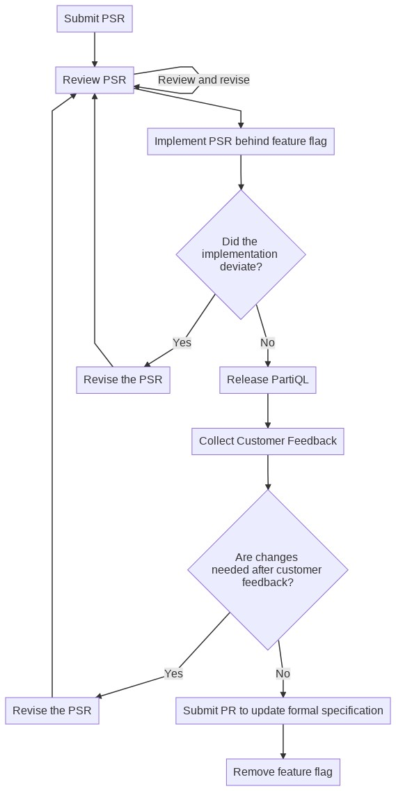

# A Proposal for Specification Changes

## Definitions

- PartiQL implementation: An implementation of the PartiQL specification--i.e,
  at minimum, the parser, compiler and interpreter.
- PartiQL service: A software component that combines PartiQL with data sources
  such as a OLTP storage engine or data warehouse.

## Background

In an ideal world when a new feature is added to the PartiQL language the
process for doing so would be:

- The PartiQL specification is updated *first*.
- *Then* the new feature is added to the reference implementation.  

However, this doesn't always work out so well because:

  prototype to prove the proposed behavior is implementable or desirable.  Some
- It is often difficult to precisely specify new features if there is no
  experimentation may be required in order to know the best way for a new
  feature to be implemented.
- The time and resources of the PartiQL steering committee may not be
  immediately available to review every proposal in depth, and to re-review as
  changes to the proposed features are discovered during implementation.
- There may not be enough time to update the specification before delivery of a
  new feature.

To address these concerns, we should we adopt a process for revising the
specification.

## PartiQL Specification Requests

The term `PSR`: stands for PartiQL Specification Request.  PSRs are documents
that describe proposed changes to the PartiQL specification.  They exist as
documents that reside in the
[`partiql-spec`](https://github.com/partiql/partiql-spec) GitHub repository.
Examples of PSRs might include proposals to:

- Add a `LET` sub-clause in various SFW queries
- Add syntax for invocation of stored procedures
- Clarify any ambiguous part of the specification (Only if clarification results
  in changes to the reference implementation.  If no changes to the reference
  implementation are needed then a standard GitHub PR should be submitted.

PSRs may be submitted by any party.

## PSR Process

1. The requester should create a document according the template in the `psr`
  subdirectory of the main specification's
  [repository](https://github.com/partiql/partiql-spec) and a GitHub pull
  request.
2. The PartiQL steering committee may review and recommend changes to the PSR
  before the PR is merged and implementation begins. 
3. A new "feature flag" should then be added to the [PartiQL reference
  implementation](https://github.com/partiql/partiql-lang-kotlin)
    - A feature flag is a boolean configuration option that defaults to off.  
    - Feature flags allow a PartiQL implementation to have experimental features
      that are not enabled by default, thus preventing end-users from taking
      dependencies on experimental features that are not fully finalized.
    - When the feature flag is off and an attempt to use the corresponding
      feature is made, the implementation must raise an error condition which
      indicates the feature flag must be explicitly enabled to use the feature.
4. The PSR then should be implemented.
5. If the PSR could not be implemented *exactly* as described, the PSR should be
   revised and steps 2-4 repeated as needed.
6. The PartiQL implementation should be released.
7. The feature should be enabled in a PartiQL service and customer feedback
   should be collected.
8. If the customer feedback indicates that additional changes are needed, revise
   the PSR and repeat steps 2-8.
9. Create a GitHub pull request to revise the formal specification with the
   changes outlined in the PSR.

   

<!-- 

To edit this flowchart:

- Navigate to the link below.
- Revise the flowchart as needed.
- Copy & paste the new URL in your browser after the revising.
- Replace `psr-process.jpeg` the "link to image" (at bottom of page)

https://mermaid-js.github.io/mermaid-live-editor/#/edit/eyJjb2RlIjoiZ3JhcGggVERcbiAgICBTdWJtaXRQU1JbU3VibWl0IFBTUl0gLS0-ICBSZXZpZXdQU1IoUmV2aWV3IGJ5IHBhcnRpcWwgdGVhbSBhbmQgY29tbWl0dGVlIHJlcClcbiAgICBSZXZpZXdQU1IgLS0-fFJldmlldyBhbmQgcmV2aXNlfCBSZXZpZXdQU1JbUmV2aWV3IFBTUl1cbiAgICBSZXZpZXdQU1IgLS0-IEltcGxlbWVudFBTUlxuICAgIEltcGxlbWVudFBTUltJbXBsZW1lbnQgUFNSIGJlaGluZCBmZWF0dXJlIGZsYWddIC0tPiBEZXZpYXRlZFxuICAgIERldmlhdGVke0RpZCB0aGUgPGJyPmltcGxlbWVudGF0aW9uIDxicj5kZXZpYXRlP30gLS0-IHxOb3xSZWxlYXNlUGFydGlRTFxuICAgIERldmlhdGVkIC0tPnxZZXN8UmV2aXNlUFNSMlxuICAgIFJldmlzZVBTUltSZXZpc2UgdGhlIFBTUl0gLS0-IFJldmlld1BTUlxuICAgIFJldmlzZVBTUjJbUmV2aXNlIHRoZSBQU1JdIC0tPiBSZXZpZXdQU1JcbiAgICBSZWxlYXNlUGFydGlRTFtSZWxlYXNlIFBhcnRpUUxdIC0tPiBDdXN0b21lckZlZWRiYWNrXG4gICAgQ3VzdG9tZXJGZWVkYmFja1tDb2xsZWN0IEN1c3RvbWVyIEZlZWRiYWNrXSAtLT5cbiAgICBDaGFuZ2VzTmVlZGVke0FyZSBjaGFuZ2VzIDxicj4gbmVlZGVkIGFmdGVyIGN1c3RvbWVyIDxicj4gIGZlZWRiYWNrP30gLS0-fFllc3xSZXZpc2VQU1JcbiAgICBDaGFuZ2VzTmVlZGVkLS0-fE5vfFVwZGF0ZUZvcm1hbFNwZWMgLS0-IFJlbW92ZUZGW1JlbW92ZSBmZWF0dXJlIGZsYWddXG4gICAgVXBkYXRlRm9ybWFsU3BlY1tTdWJtaXQgUFIgdG8gdXBkYXRlIGZvcm1hbCBzcGVjaWZpY2F0aW9uXSIsIm1lcm1haWQiOnsidGhlbWUiOiJkZWZhdWx0IiwidGhlbWVWYXJpYWJsZXMiOnsiYmFja2dyb3VuZCI6IndoaXRlIiwicHJpbWFyeUNvbG9yIjoiI0VDRUNGRiIsInNlY29uZGFyeUNvbG9yIjoiI2ZmZmZkZSIsInRlcnRpYXJ5Q29sb3IiOiJoc2woODAsIDEwMCUsIDk2LjI3NDUwOTgwMzklKSIsInByaW1hcnlCb3JkZXJDb2xvciI6ImhzbCgyNDAsIDYwJSwgODYuMjc0NTA5ODAzOSUpIiwic2Vjb25kYXJ5Qm9yZGVyQ29sb3IiOiJoc2woNjAsIDYwJSwgODMuNTI5NDExNzY0NyUpIiwidGVydGlhcnlCb3JkZXJDb2xvciI6ImhzbCg4MCwgNjAlLCA4Ni4yNzQ1MDk4MDM5JSkiLCJwcmltYXJ5VGV4dENvbG9yIjoiIzEzMTMwMCIsInNlY29uZGFyeVRleHRDb2xvciI6IiMwMDAwMjEiLCJ0ZXJ0aWFyeVRleHRDb2xvciI6InJnYig5LjUwMDAwMDAwMDEsIDkuNTAwMDAwMDAwMSwgOS41MDAwMDAwMDAxKSIsImxpbmVDb2xvciI6IiMzMzMzMzMiLCJ0ZXh0Q29sb3IiOiIjMzMzIiwibWFpbkJrZyI6IiNFQ0VDRkYiLCJzZWNvbmRCa2ciOiIjZmZmZmRlIiwiYm9yZGVyMSI6IiM5MzcwREIiLCJib3JkZXIyIjoiI2FhYWEzMyIsImFycm93aGVhZENvbG9yIjoiIzMzMzMzMyIsImZvbnRGYW1pbHkiOiJcInRyZWJ1Y2hldCBtc1wiLCB2ZXJkYW5hLCBhcmlhbCIsImZvbnRTaXplIjoiMTZweCIsImxhYmVsQmFja2dyb3VuZCI6IiNlOGU4ZTgiLCJub2RlQmtnIjoiI0VDRUNGRiIsIm5vZGVCb3JkZXIiOiIjOTM3MERCIiwiY2x1c3RlckJrZyI6IiNmZmZmZGUiLCJjbHVzdGVyQm9yZGVyIjoiI2FhYWEzMyIsImRlZmF1bHRMaW5rQ29sb3IiOiIjMzMzMzMzIiwidGl0bGVDb2xvciI6IiMzMzMiLCJlZGdlTGFiZWxCYWNrZ3JvdW5kIjoiI2U4ZThlOCIsImFjdG9yQm9yZGVyIjoiaHNsKDI1OS42MjYxNjgyMjQzLCA1OS43NzY1MzYzMTI4JSwgODcuOTAxOTYwNzg0MyUpIiwiYWN0b3JCa2ciOiIjRUNFQ0ZGIiwiYWN0b3JUZXh0Q29sb3IiOiJibGFjayIsImFjdG9yTGluZUNvbG9yIjoiZ3JleSIsInNpZ25hbENvbG9yIjoiIzMzMyIsInNpZ25hbFRleHRDb2xvciI6IiMzMzMiLCJsYWJlbEJveEJrZ0NvbG9yIjoiI0VDRUNGRiIsImxhYmVsQm94Qm9yZGVyQ29sb3IiOiJoc2woMjU5LjYyNjE2ODIyNDMsIDU5Ljc3NjUzNjMxMjglLCA4Ny45MDE5NjA3ODQzJSkiLCJsYWJlbFRleHRDb2xvciI6ImJsYWNrIiwibG9vcFRleHRDb2xvciI6ImJsYWNrIiwibm90ZUJvcmRlckNvbG9yIjoiI2FhYWEzMyIsIm5vdGVCa2dDb2xvciI6IiNmZmY1YWQiLCJub3RlVGV4dENvbG9yIjoiYmxhY2siLCJhY3RpdmF0aW9uQm9yZGVyQ29sb3IiOiIjNjY2IiwiYWN0aXZhdGlvbkJrZ0NvbG9yIjoiI2Y0ZjRmNCIsInNlcXVlbmNlTnVtYmVyQ29sb3IiOiJ3aGl0ZSIsInNlY3Rpb25Ca2dDb2xvciI6InJnYmEoMTAyLCAxMDIsIDI1NSwgMC40OSkiLCJhbHRTZWN0aW9uQmtnQ29sb3IiOiJ3aGl0ZSIsInNlY3Rpb25Ca2dDb2xvcjIiOiIjZmZmNDAwIiwidGFza0JvcmRlckNvbG9yIjoiIzUzNGZiYyIsInRhc2tCa2dDb2xvciI6IiM4YTkwZGQiLCJ0YXNrVGV4dExpZ2h0Q29sb3IiOiJ3aGl0ZSIsInRhc2tUZXh0Q29sb3IiOiJ3aGl0ZSIsInRhc2tUZXh0RGFya0NvbG9yIjoiYmxhY2siLCJ0YXNrVGV4dE91dHNpZGVDb2xvciI6ImJsYWNrIiwidGFza1RleHRDbGlja2FibGVDb2xvciI6IiMwMDMxNjMiLCJhY3RpdmVUYXNrQm9yZGVyQ29sb3IiOiIjNTM0ZmJjIiwiYWN0aXZlVGFza0JrZ0NvbG9yIjoiI2JmYzdmZiIsImdyaWRDb2xvciI6ImxpZ2h0Z3JleSIsImRvbmVUYXNrQmtnQ29sb3IiOiJsaWdodGdyZXkiLCJkb25lVGFza0JvcmRlckNvbG9yIjoiZ3JleSIsImNyaXRCb3JkZXJDb2xvciI6IiNmZjg4ODgiLCJjcml0QmtnQ29sb3IiOiJyZWQiLCJ0b2RheUxpbmVDb2xvciI6InJlZCIsImxhYmVsQ29sb3IiOiJibGFjayIsImVycm9yQmtnQ29sb3IiOiIjNTUyMjIyIiwiZXJyb3JUZXh0Q29sb3IiOiIjNTUyMjIyIiwiY2xhc3NUZXh0IjoiIzEzMTMwMCIsImZpbGxUeXBlMCI6IiNFQ0VDRkYiLCJmaWxsVHlwZTEiOiIjZmZmZmRlIiwiZmlsbFR5cGUyIjoiaHNsKDMwNCwgMTAwJSwgOTYuMjc0NTA5ODAzOSUpIiwiZmlsbFR5cGUzIjoiaHNsKDEyNCwgMTAwJSwgOTMuNTI5NDExNzY0NyUpIiwiZmlsbFR5cGU0IjoiaHNsKDE3NiwgMTAwJSwgOTYuMjc0NTA5ODAzOSUpIiwiZmlsbFR5cGU1IjoiaHNsKC00LCAxMDAlLCA5My41Mjk0MTE3NjQ3JSkiLCJmaWxsVHlwZTYiOiJoc2woOCwgMTAwJSwgOTYuMjc0NTA5ODAzOSUpIiwiZmlsbFR5cGU3IjoiaHNsKDE4OCwgMTAwJSwgOTMuNTI5NDExNzY0NyUpIn19fQ]
  

-->

